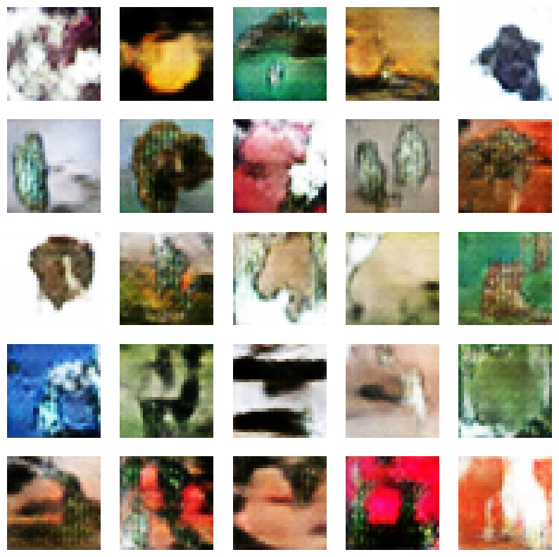

# CIFAR-100 GAN Project

## 📌 Project Overview
This project implements a Generative Adversarial Network (GAN) to generate synthetic images based on the CIFAR-100 dataset. The model consists of a generator and a discriminator trained using the adversarial learning approach.

## 🖼 Dataset
- **Dataset:** CIFAR-100
- **Image Size:** 32x32
- **Classes:** 100
- **Preprocessing:** Normalized to [-1,1]

## 📦 Requirements
Ensure you have the required dependencies installed before running the project on google colab.

```sh
!pip install tensorflow tensorflow-gpu matplotlib tensorflow-datasets ipywidgets

```

## 🚀 How to Run
Clone the repository and navigate to the project directory:

```sh
git clone https://github.com/1sahmuel/GAN_project.git

```

## 🏗 Model Architecture
### Generator
- Dense layer with shape `(8, 8, 256)`
- Batch normalization & LeakyReLU activations
- Transposed convolution layers upsampling to `(32, 32, 3)`

### Discriminator
- Convolutional layers with strides `(2,2)`
- LeakyReLU activations & Dropout layers
- Dense output layer with sigmoid activation

## 📊 Training Details
| Parameter   | Value  |
|------------|--------|
| Batch Size | 64   |
| Epochs     | 100    |
| Learning Rate | 0.0001 |

## 🔥 Sample Results
During training, generated images improve over time. Below is an example output from the generator:




> **Note:** Training for more epochs improves the quality of generated images.

## 📧 Contact
For inquiries, reach out via 1sahmuel@gmail.com.
